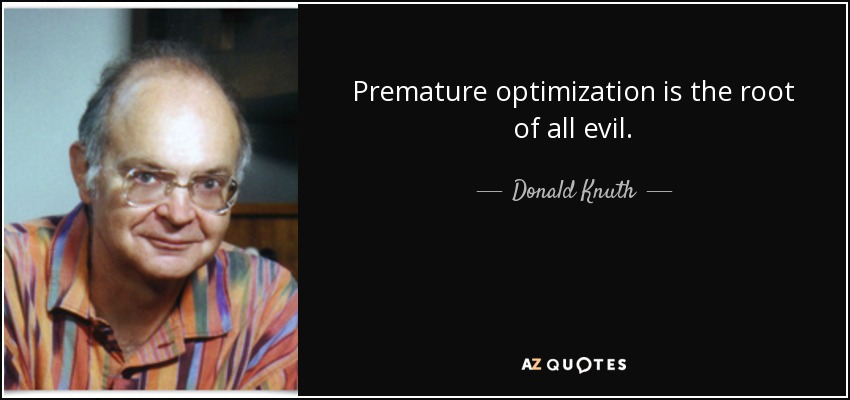

<!-- _class: all-centered -->
<!-- _backgroundImage: "linear-gradient(to bottom, #f05053, #e1eec3)" -->

# <!--fit--> Optimizing and structuring python code
## HWSA 2021

Simon Mutch

---

# Session outline [[.large]]


* Presentation
    - Optimisation
    - Documentation
    - Tips, tricks & tools
* Practical
    - Open ended session with a short code to try some of these techniques out on.
    - **:trophy: Competition :trophy:**: Who can achieve the greatest speed-up? :stopwatch:

---


#

---

# The optimisation cycle


1) Profile
2) Develop regression tests
3) Baseline timing
4) Optimise identified bottlenecks
5) Time
6) Test
7) Profile then go back to 4
   **or** call it a day and bask in glory

---

# cProfile

<div data-marpit-fragment>

`cProfile` is part of the Python standard library _(you don't need to manually install it)_.
It gives statistics for function calls and is often the best place to start when profiling Python code.
</div>

<div data-marpit-fragment>

```python {0}
import cProfile
import pstats

profile = cProfile.Profile()

profile.enable()

dn_dlogm_list = []
for z in z_list:
    dn_dlogm_list.append(press_schecter(M_list, z, A_std_func()))

profile.disable()

ps = pstats.Stats(profile).strip_dirs().sort_stats(pstats.SortKey.TIME)
ps.print_stats()
```

</div>

---

# cProfile

`cProfile` is part of the Python standard library _(you don't need to manually install it)_.
It gives statistics for function calls and is often the best place to start when profiling Python code.

<div>

```python {6,12}
import cProfile
import pstats

profile = cProfile.Profile()

profile.enable()

dn_dlogm_list = []
for z in z_list:
    dn_dlogm_list.append(press_schecter(M_list, z, A_std_func()))

profile.disable()

ps = pstats.Stats(profile).strip_dirs().sort_stats(pstats.SortKey.TIME)
ps.print_stats()
```

</div>

---

# cProfile

`cProfile` is part of the Python standard library _(you don't need to manually install it)_.
It gives statistics for function calls and is often the best place to start when profiling Python code.

<div>

```python {14,15}
import cProfile
import pstats

profile = cProfile.Profile()

profile.enable()

dn_dlogm_list = []
for z in z_list:
    dn_dlogm_list.append(press_schecter(M_list, z, A_std_func()))

profile.disable()

ps = pstats.Stats(profile).strip_dirs().sort_stats(pstats.SortKey.TIME)
ps.print_stats()
```

</div>

---

# cProfile

```
         3326986 function calls in 8.092 seconds

   Ordered by: internal time

   ncalls  tottime  percall  cumtime  percall filename:lineno(function)
  1094475    4.079    0.000    4.079    0.000 press_schecter.py:22(tophat_ft)
  1094475    2.482    0.000    2.482    0.000 press_schecter.py:27(power)
  1094100    0.894    0.000    7.454    0.000 press_schecter.py:38(<lambda>)
     4005    0.536    0.000    7.992    0.002 {built-in method scipy.integrate._quadpack._qagie}
     1000    0.018    0.000    6.116    0.006 common.py:75(derivative)
     1000    0.012    0.000    0.012    0.000 {method 'reduce' of 'numpy.ufunc' objects}
        5    0.012    0.002    8.089    1.618 press_schecter.py:69(press_schecter)
```

* **tottime**: time spent inside this function
* **cumtime**: time spent inside this function and all functions it calls
* **percall**: cumulative time per call

---

# line_profiler

What if we want to go deeper though?
_Where_ in the function are we spending all of our time? Calculating logarithms, multiplying numbers?

<div data-marpit-fragment>

```python
@profile
def press_schechter(...):
    ...
```

```sh
> kernprof -l press_schecter.py
> python3 -m line_profiler press_schechter.py.lprof
```

</div>

---

# line_profiler

<style scoped>
pre,pre[class*="language-"]{
    font-size: 0.5rem;
}
ul {
    flex-direction: row;
    display: flex;
    font-size: 0.6rem;
}
li {
    margin-left: 1rem;
    margin-top: 0.25rem;
}
</style>

```
Function: press_schecter at line 66

Line #      Hits         Time  Per Hit   % Time  Line Contents
==============================================================
    66                                           @profile
    67                                           def press_schecter(M_list, z, A_std):
    68         5        115.0     23.0      0.0      R_list = (2 * (M_list) * G / (h0 ** 2 * wm)) ** (1 / 3)
    69         5         18.0      3.6      0.0      rho = rho_m(z=0)
    70
    71         5        764.0    152.8      0.0      d_c = d_crit(z)
    72
    73         5          4.0      0.8      0.0      dn_dlogm = []
    74      1005       1436.0      1.4      0.0      for r in R_list:
    75      1000    3266597.0   3266.6     24.3          std = stdev(r, A=A_std)
    76      1000       2010.0      2.0      0.0          deriv = (
    77      1000   10167353.0  10167.4     75.6              2 * G / (3 * h0 ** 2 * wm * r ** 2) * \
                                                            derivative(lambda rr: np.log(stdev(rr, A=A_std)), x0=r, dx=r * 0.5)
    78                                                   )
    79      1000       1078.0      1.1      0.0          nu = d_c / std
    80      1000       9737.0      9.7      0.1          dn_dlogm.append( \
                                                            np.sqrt(2 / np.pi) * rho * -deriv * nu * np.exp(-(nu ** 2) / 2) \
                                                         )
    81         5          3.0      0.6      0.0      return dn_dlogm
```

* **Hits**: Number of times this line is called.
* **Total**: Cumulative time spent on this line.
* **Per Hit**: Time spent on line each time it's called.
* **% Time**: Percentage of time spent on this line relative to whole function.

---

<!-- _class: all-centered -->


<style scoped>
ul {
    margin-bottom: 10px;
}
li,ul p {
    margin: 0;
    line-height: 1.2rem;
    font-size: 0.8rem;
}
li,ul {
    padding-left: 0px;
}
ul ul {
    padding-left: 20px;
}
ul ul li {
    font-size: 0.7rem;
    line-height: 1rem;
}
</style>

# Testing

- **Unit tests**: Ideally test the smallest logical units of your code (e.g. individual functions).
    - Should (ideally) test correctness, edge cases and unexpected input.
- **Integration tests**: Tests larger units or the whole code and how they interact.
    - Should (ideally) test correctness, edge cases and unexpected input.
- **Regression tests**: Tests larger units or the whole code to make sure you recover the same answer after changes.
    - Sometimes you don't want these (e.g. when changing physical models), but they are **very important** for optimisation.

<div data-marpit-fragment>

**Make testing part of your routine**.
It's a lot easier to write tests as you go along, rather than coming back after-the-fact.
[[.standout]]

<style scoped>
p.standout {
    font-size: 0.8rem;
    padding: 0 0.3rem;
    text-align: right;
}
</style>

</div>

---

# Pytest

<!-- _footer: <sup>1</sup> See also https://github.com/astropy/pytest-arraydiff\nhttps://github.com/smutch/code_prac_hwsa2021 -->


<style scoped>
ul {margin-top: -15px;}
li {margin: 0;}
</style>

Covering [pytest](https://docs.pytest.org/) and all it has to offer would take a whole session itself!
There are a lot of great examples and articles online.

Some useful topics to check out include:
- Fixtures
- Parameterizing tests
- Setting up continuous integration (CI) for automated testing
- Coverage measurements

For regression testing, the [regtest](https://pypi.org/project/pytest-regtest/) plugin is popular<sup>1</sup>...

---

# Regression tests with pytest-regtest

Naming of directories, files and functions all matter with pytest. You can configure this, but standard practice is:
- Place all of your tests in a directory called `tests`.
- You need to have a `__init__.py` file in `tests` (to make them part of a module) but it can be empty.
- Each file should be called `test_*.py`.
- Each test function should be called `test_*`.

```
tests
├── __init__.py
└── test_regressions.py
```

```py
def test_regressions(...): ...
```

---

# Regression tests with pytest-regtest

```py
import numpy as np
from pytest_regtest import regtest

from code_prac import press_schechter

def test_press_schechter(regtest):

    redshifts = [0.0, 5.0, 10.0, 20.0, 30.0]
    masses = np.logspace(2, 15, 200)

    result = press_schechter(redshifts, masses)

    with regtest:
        print(result)
```

Need to initialise and store the expected output the first time around.

```sh
> pytest --regtest-reset
```

The results will go in `tests/_regtest_outputs/` which should be committed to version control.

---

# Regression tests with pytest-regtest

Now, after trying to optimise the code, we can check we still get the right result using:

```
> pytest

============================================================================== test session starts ==============================================================================
platform darwin -- Python 3.9.5, pytest-6.2.4, py-1.10.0, pluggy-0.13.1
rootdir: /blaa/blaa/code_prac_hwsa2021
plugins: regtest-1.4.6
collected 1 item

tests/test_regressions.py .                                                                                                                                               [100%]

=============================================================================== 1 passed in 9.22s ===============================================================================
```

---

# Regression tests with pytest-regtest

If the output of the `press_schechter` function changes:

```
> pytest

============================================================================== test session starts ==============================================================================
platform darwin -- Python 3.9.5, pytest-6.2.4, py-1.10.0, pluggy-0.13.1
rootdir: /Users/smutch/work/training/harleywood-2021/code_prac_hwsa2021
plugins: regtest-1.4.6
collected 1 item

tests/test_regressions.py F                                                                                                                                               [100%]

=================================================================================== FAILURES ====================================================================================
_____________________________________________________________________________ test_press_schechter ______________________________________________________________________________

regression test output differences for tests/test_regressions.py::test_press_schechter:

>   --- current
>   +++ tobe
>   @@ -1,2 +1,2 @@
>   -[[3943684.4663377525, 3433036.716787263, 2988666.7237358466, 2601939.030501016, 2265406.0334823187, 1972476.6100945876, 1717547.9139849006, 1495624.5560116607, 1302452.0154

...

============================================================================ short test summary info ============================================================================
FAILED tests/test_regressions.py::test_press_schechter
============================================================================== 1 failed in 10.03s ===============================================================================

```

---

# <!-- _class: all-centered -->
# <!-- fit --> Let's go fast!

---

# Things to know about Python and speed

## Python is an interpreted language and (almost) everything is an object

This means there is a cost with looking up and accessing values.

```python
a = 8.0 
print(a)
```

Translated to C this is actually something more like _(but in reality way more complicated!)_:

```c
void *a = (void*)malloc(sizeof(double));
*(int*)a = 8.0;
printf("{:g}\n", *((int*)a));
```

---

# **The most important** scientific python optimisation rule

#### For loops should be avoided if possible. Take advantage of Numpy's ufuncs (which will vectorize it and do it more efficiently).

```python
arr = np.arange(100_000)

# BAD: 165 ms ± 4.78 ms per loop (mean ± std. dev. of 7 runs, 1 loop each)
for ii, val in enumerate(arr):
    arr[ii] = np.sqrt(val)

# GOOD: 147 µs ± 2.51 µs per loop (mean ± std. dev. of 7 runs, 10000 loops each)
arr = np.sqrt(arr)
```

<div data-marpit-fragment>

147 µs = 0.147 ms
∴ x1,112 speed up !!! :open_mouth:

</div>

---

# An aside...
## A common misconception

Numpy `vectorize` does not "vectorize" your code!

From the docs:

"The vectorize function is provided primarily for convenience, not for performance. The implementation is essentially a for loop."
-- _Numpy docs_
[[.quote]]


---

# I've removed all the loops I can, but I still need more speed!!!


<style scoped>
ul {font-size: 0.8rem;}
h1 {line-height: 1.5rem;}
</style>

There are a number of techniques and tools at our disposal. Which ones will work best is heavily dependent on the problem:
- Use 3rd-party libraries which are already optimised!
    **(I won't cover this, but it should always be your first stop.)**
- Algorithmic changes (e.g. identifying redundant calculations).
- Memoisation (caching of results for reuse later)
- Dropping down to a lower level using [Numba](https://numba.pydata.org/), [Cython](https://numba.pydata.org/), etc.
- Parallelisation

---

<!--
   - ---

   - # test
   - 
   - <div style="overflow: hidden;">
   - <div style="position: absolute;" data-marpit-fragment>
   - 
   - 
   - 
   - </div>
   - 
   - <div style="position: absolute;" data-marpit-fragment>
   - 
   - 
   - 
   - </div>
   - 
   - <div style="position: absolute;" data-marpit-fragment>
   - 
   - 
   - 
   - </div>
   - 
   - </div>
   -->
